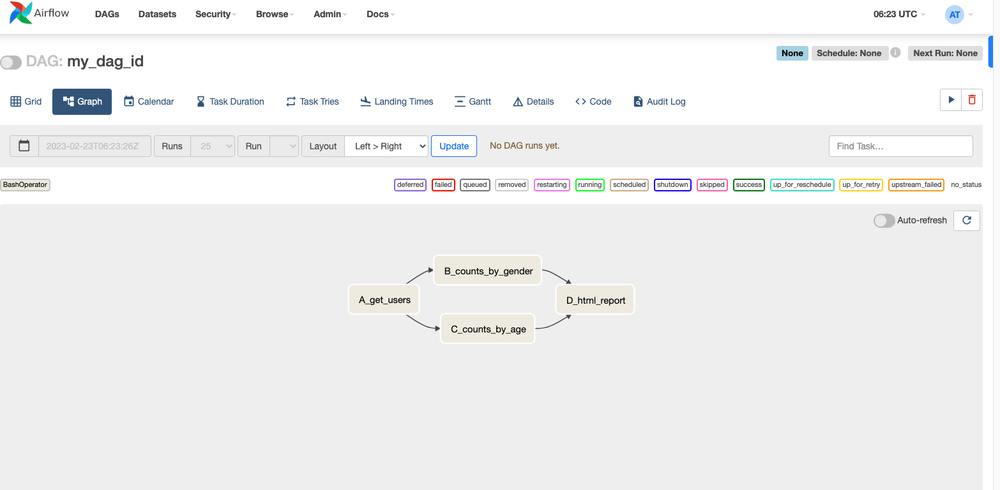

# zlift_internal_airflow
Z lift internal airflow testing

## R Script Automation Exploration: 

Here are a few ways we can automate R scripts, for exploration. 

**1. Apahce Airflow** 

Principles: 
- Scalable
- Dynamic
- Extensible
- Elegant

Features:
- Pure Python
- Useful UI 
- Robust Integrations
- Easy to Use
- Open Source 

- Installation: 
```
pip install "apache-airflow[celery]==2.5.1" --constraint "https://raw.githubusercontent.com/apache/airflow/constraints-2.5.1/constraints-3.7.txt"

export AIRFLOW_HOME="$(pwd)"


airflow users create \
          --username admin \
          --firstname Amber \
          --lastname Teng \
          --role Admin \
          --email ambert@z-liftsolutions.com

airflow webserver

export AIRFLOW_HOME="$(pwd)/airflow_home"
airflow scheduler
```

- https://airflow.apache.org/docs/apache-airflow/stable/installation/index.html

Note that the username and password are what were entered in the setup stage above. 

Note that in Windows this would be: 

```
export AIRFLOW_HOME=`pwd`/airflow_home
```



If you forget your password, you can't reset it just locally, but you can delete a user then add a new one like the ff:  

```
airflow users delete -u admin -e ambert@z-liftsolutions.com
```

**2. Cron Job**


**3. CronR Library or taskscheduleR** 

- https://cran.r-project.org/web/packages/cronR/readme/README.html

```
Adding cronjob:
---------------

## cronR job
## id:   test2
## tags: lab, xyz
## desc: basic loading and printing of data
0-59 * * * * /Library/Frameworks/R.framework/Resources/bin/Rscript '/Users/angelateng/Documents/GitHub/zlift_internal_airflow/sampleRscript.R'  >> '/Users/angelateng/Documents/GitHub/zlift_internal_airflow/sampleRscript.log' 2>&1
```

## Requirements: 
- R Scripts 
- Automation
- AWS Environment (future state)


## Debugging: 

- R Script Error: 
```
> Hmisc::describe(df)  
Error in x[present, drop = FALSE] : 
  object of type 'closure' is not subsettable
In addition: Warning messages:
1: In is.na(x) : is.na() applied to non-(list or vector) of type 'closure'
2: In is.na(x) : is.na() applied to non-(list or vector) of type 'closure'
```

- If the Airflow UI + PID errors out: 
  - https://stackoverflow.com/questions/45853013/airflow-tasks-get-stuck-at-queued-status-and-never-gets-running


## Resources:
- https://anderfernandez.com/en/blog/how-to-automate-r-scripts-on-windows-and-mac/#:~:text=To%20automate%20R%20scripts%20in%20MacOs%20is%20nearly%20as%20easy,the%20equivalent%20of%20Window's%20TaskScheduler. 
- https://lcalcagni.medium.com/running-r-scripts-in-airflow-using-airflow-bashoperators-6d827f5da5b1 
- Airflow cheat sheet: https://levelup.gitconnected.com/airflow-command-line-interface-cli-cheat-sheet-6e5d90bd3552 